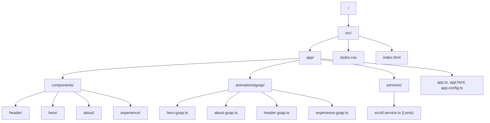

# Portfolio: Victor Lorencio

Este proyecto es un portfolio profesional desarrollado con un stack moderno enfocado en el rendimiento y la experiencia de usuario (UX/UI) mediante animaciones premium.

## 🚀 Tecnologías Principales

| Tecnología | Versión | Propósito |
| :--- | :--- | :--- |
| **Angular** | 21.0.0 | Framework principal (SPA con SSR) |
| **TypeScript** | 5.9.2 | Lenguaje de desarrollo |
| **Tailwind CSS** | 3.4.19 | Sistema de diseño y estilos utilitarios |
| **GSAP** | 3.14.2 | Motor de animaciones de alto rendimiento |
| **Lenis** | 1.3.17 | Scroll suave (Smooth Scrolling) |
| **Lucide Angular** | 0.562.0 | Set de iconos vectoriales |
| **Express** | 5.1.0 | Servidor para SSR (Server-Side Rendering) |

---

## 📂 Estructura de Carpetas

La arquitectura sigue las mejores prácticas de Angular, separando la lógica de animación de la estructura de los componentes.

### Detalle de Directorios Clave:
- **`src/app/components/`**: Bloques funcionales de la web.
- **`src/app/animations/gsap/`**: **Arquitectura de Animación Única**. Lógica visual separada de los componentes.
- **`src/app/services/`**: Servicios globales como la gestión de scroll suave.
- **`src/styles.css`**: Configuración de Tailwind y tipografías personalizadas.

---

## ✨ Características Destacadas

1. **Animaciones Premium (GSAP)**:
   - Revelado tipo "máquina de escribir" en el Hero.
   - Ondas de fondo dinámicas y fluidas.
   - Revelado por "masking" en la sección de experiencia.

2. **Scroll Suave**: Implementación de **Lenis** sincronizada con el motor de animaciones.
3. **Alto Rendimiento**: Renderizado del lado del servidor (SSR) y uso de **Angular Signals**.

---

## 🛠️ Desarrollo

### Servidor de Desarrollo
Ejecuta `npm start` para iniciar el servidor local en `http://localhost:4200/`.

### Producción (Build)
Ejecuta `npm run build` para compilar el proyecto. Los archivos se guardarán en el directorio `dist/`.

### Tests
Ejecuta `npm test` para correr los unit tests con Vitest.
